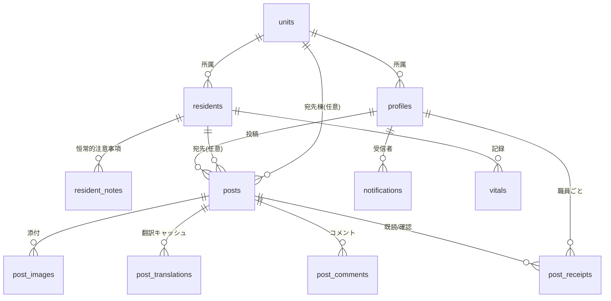

# テーブル設計書 — ケア申し送り共有アプリ

- 版: v2.0 (2026-07-14)
- DB: PostgreSQL (Supabase)
- 関連資料: `requirements_v2.md` / `wireframe_v3.html`

## v1 → v2 変更履歴

1. 全テーブルに updated_at を追加(トリガーで自動更新)
2. posts / post_comments は投稿後の編集不可の運用方針を明記(訂正は新規投稿・追記コメントで行う)
3. resident_notes(利用者ごとの恒常的な注意事項)を新規追加 — フロー情報(posts)とストック情報の分離
4. post_comments(コメント)を新規追加 — フラット構造(ネストなし)
5. notifications(通知)を新規追加 — 質疑のループを閉じるため
6. RLSに「利用者・職員の登録系は管理者のみ」を明記
7. units はテーブルとして維持(棟の増減・改名耐性、表記ゆれ防止)/ カテゴリはテーブル化せず CHECK 制約(機能と結びついた固定分類のため)— 判断理由を §5 に記載

---

## 1. 全体像(ER図 / Mermaid記法・GitHub上で図として表示)

テーブル数: 12。認証情報は Supabase の auth.users が管理。
共通ルール: 全テーブルに created_at / updated_at (timestamptz, DEFAULT now())。updated_at は共通トリガー関数で自動更新。以下の定義では両カラムの記載を省略する。

---

## 2. テーブル定義

### 2.1 units — 棟

| カラム | 型 | 制約 | 説明 |
|---|---|---|---|
| id | smallint | PK | |
| name | text | NOT NULL | 例: 1棟, 2棟 |

### 2.2 profiles — 職員(auth.users と1対1)

| カラム | 型 | 制約 | 説明 |
|---|---|---|---|
| id | uuid | PK, FK → auth.users.id | |
| name | text | NOT NULL | |
| avatar_url | text | | |
| role | text | NOT NULL, CHECK | 'caregiver' / 'nurse' / 'admin' |
| unit_id | smallint | FK → units.id | 所属棟 |
| display_mode | text | NOT NULL, DEFAULT 'ja' | 'ja' / 'furigana' / 'en' / 'th' |
| is_active | boolean | DEFAULT true | 退職時 false(削除しない) |

### 2.3 residents — 利用者(全員架空データ)

| カラム | 型 | 制約 | 説明 |
|---|---|---|---|
| id | uuid | PK | |
| name | text | NOT NULL | |
| room_number | text | | |
| unit_id | smallint | FK → units.id | |
| care_level | smallint | CHECK 1〜5 | 要介護度 |
| avatar_url | text | | |
| is_active | boolean | DEFAULT true | 退所時 false |

※ v1 にあった notes(自由メモ)は resident_notes へ分割・廃止。

### 2.4 resident_notes — 恒常的な注意・連絡事項(新規)

タイムラインを流れてはいけないストック情報。利用者詳細画面の上部に常時表示。

| カラム | 型 | 制約 | 説明 |
|---|---|---|---|
| id | uuid | PK | |
| resident_id | uuid | NOT NULL, FK → residents.id | |
| category | text | NOT NULL, CHECK(postsと同一の値リスト) | 'meal' / 'oral_care' / 'excretion' / 'sleep' / 'health' / 'family' / 'other' |
| content | text | NOT NULL | 例: トロミ剤必要・卵アレルギー |
| updated_by | uuid | FK → profiles.id | 最終更新者(責任の可視化) |

### 2.5 posts — 申し送り投稿

| カラム | 型 | 制約 | 説明 |
|---|---|---|---|
| id | uuid | PK | |
| author_id | uuid | NOT NULL, FK → profiles.id | |
| resident_id | uuid | FK → residents.id, NULL可 | NULL=利用者に紐づかない連絡 |
| unit_id | smallint | FK → units.id, NULL可 | NULL=全体宛 |
| category | text | NOT NULL, CHECK | resident_notes と同一の値リスト |
| body | text | NOT NULL | 原文 |
| body_lang | text | NOT NULL, DEFAULT 'ja' | 原文の言語 |
| is_important | boolean | DEFAULT false | 重要(確認必須) |
| family_approved | boolean | DEFAULT false | 家族了承済み |

運用方針: 投稿後の本文編集は不可(RLSでUPDATE禁止)。訂正は新規投稿またはコメントで行う。「言った言わない」を防ぐ記録としての信頼性を優先。

### 2.6 post_images — 添付画像

| カラム | 型 | 制約 | 説明 |
|---|---|---|---|
| id | uuid | PK | |
| post_id | uuid | NOT NULL, FK → posts.id | |
| storage_path | text | NOT NULL | クライアント側で圧縮済み |
| thumb_path | text | | サムネイル |
| sort_order | smallint | DEFAULT 0 | |

### 2.7 post_translations — 翻訳キャッシュ

投稿時に1回だけ翻訳APIを実行し保存。ふりがなは kuroshiro でクライアント側生成のためテーブル不要。

| カラム | 型 | 制約 | 説明 |
|---|---|---|---|
| id | uuid | PK | |
| post_id | uuid | NOT NULL, FK → posts.id | |
| lang | text | NOT NULL | 'ja' / 'en' / 'th' |
| body | text | NOT NULL | |
| | | UNIQUE(post_id, lang) | |

### 2.8 post_comments — コメント(新規)

質疑・補足のための公開コメント。フラット構造(ネストなし)。

| カラム | 型 | 制約 | 説明 |
|---|---|---|---|
| id | uuid | PK | |
| post_id | uuid | NOT NULL, FK → posts.id | |
| author_id | uuid | NOT NULL, FK → profiles.id | |
| body | text | NOT NULL | |

- コメントへのコメント(ネスト)は非対応。名前の呼びかけ運用で足りる規模のため
- コメントに既読/確認は付けない(確認が必要な内容は本体投稿の重要フラグで行う整理)
- 編集不可は posts と同方針
- 将来拡張: reply_to_comment_id による引用表示(ロードマップ)

### 2.9 post_receipts — 既読・確認

| カラム | 型 | 制約 | 説明 |
|---|---|---|---|
| id | uuid | PK | |
| post_id | uuid | NOT NULL, FK → posts.id | |
| staff_id | uuid | NOT NULL, FK → profiles.id | |
| read_at | timestamptz | NOT NULL, DEFAULT now() | 詳細を開いた時刻(自動) |
| confirmed_at | timestamptz | NULL可 | 確認ボタン押下時刻 |
| | | UNIQUE(post_id, staff_id) | |

状態導出: 行なし=未読 / read_atのみ=既読のみ / confirmed_atあり=確認済み。

### 2.10 notifications — 通知(新規)

| カラム | 型 | 制約 | 説明 |
|---|---|---|---|
| id | uuid | PK | |
| recipient_id | uuid | NOT NULL, FK → profiles.id | 受信者 |
| type | text | NOT NULL, CHECK | 'comment_on_my_post'(自分の投稿にコメント) / 'comment_on_joined_post'(参加中のコメント欄に新着) ※将来: 'important_post' 等 |
| post_id | uuid | NOT NULL, FK → posts.id | タップで投稿詳細へ遷移 |
| comment_id | uuid | FK → post_comments.id | 対象コメント |
| read_at | timestamptz | NULL可 | NULL=未読(バッジ件数の対象) |

通知の生成ルール(コメント投稿時):
通知先 = 投稿者 + その投稿の既存コメント投稿者(重複除去) − コメントを書いた本人。
これにより「質問した人は、回答が付いた瞬間に通知を受け取る」= 質疑ループが閉じる。

### 2.11 vitals — バイタル記録

| カラム | 型 | 制約 | 説明 |
|---|---|---|---|
| id | uuid | PK | |
| resident_id | uuid | NOT NULL, FK → residents.id | |
| recorded_by | uuid | NOT NULL, FK → profiles.id | |
| measured_at | timestamptz | NOT NULL | |
| temperature | numeric(3,1) | NULL可 | 体温(℃) |
| pulse | smallint | NULL可 | 脈拍 |
| bp_systolic | smallint | NULL可 | 血圧(上) |
| bp_diastolic | smallint | NULL可 | 血圧(下) |
| spo2 | smallint | NULL可 | SpO2(%) |

全項目NULL可 = 測った項目だけ記録できる。

### 2.12 vital_thresholds — バイタル基準値(施設設定)

| カラム | 型 | 制約 | 説明 |
|---|---|---|---|
| item | text | PK | 'temperature' / 'pulse' / 'bp_systolic' / 'bp_diastolic' / 'spo2' |
| min_value | numeric | NULL可 | 下限 |
| max_value | numeric | NULL可 | 上限 |
| updated_by | uuid | FK → profiles.id | |

デフォルトは一般的な参考値。医学的判断は現場に委ね、管理者が変更可能。

---

## 3. インデックス設計

| テーブル | インデックス | 用途 |
|---|---|---|
| posts | (created_at DESC) | タイムライン新着順 |
| posts | (unit_id, created_at DESC) | 棟タブ |
| posts | (resident_id, created_at DESC) | 利用者別タイムライン |
| posts | (is_important) WHERE is_important | 重要バナー(部分インデックス) |
| resident_notes | (resident_id) | 利用者詳細の注意事項欄 |
| post_comments | (post_id, created_at) | コメント欄 |
| post_receipts | (staff_id, confirmed_at) | 自分の未確認リスト |
| post_receipts | (post_id) | 確認状況一覧 |
| notifications | (recipient_id, read_at) | ベルのバッジ件数・通知一覧 |
| post_translations | UNIQUE(post_id, lang) | 翻訳取得 |
| vitals | (resident_id, measured_at DESC) | 推移グラフ |

取得は常にカーソル方式のページネーション(created_at + id)。全件取得はしない。

---

## 4. アクセス制御(Supabase RLS)方針

| テーブル | 参照 | 作成 | 更新 |
|---|---|---|---|
| posts / post_images / post_translations / post_comments | ログイン職員全員 | ログイン職員 | 不可(編集禁止方針) |
| post_receipts | 全員 | 本人の行のみ | 本人の行のみ(confirmed_at設定) |
| resident_notes | 全員 | ログイン職員 | ログイン職員(updated_byで責任を記録) |
| residents | 全員 | adminのみ | adminのみ |
| profiles | 全員 | adminのみ(招待メールで発行) | 本人(表示設定等)+ admin |
| notifications | 本人の行のみ | システム(サーバー側処理) | 本人(read_at設定) |
| vitals | 全員 | ログイン職員 | 記録者本人のみ |
| vital_thresholds | 全員 | adminのみ | adminのみ |
| units | 全員 | adminのみ | adminのみ |

権限は2層で防御: UI層(adminのみ管理画面を表示)+ DB層(RLSで強制)。UIを突破されてもDBが拒否する。

---

## 5. 主な設計判断(README・面接転用可)

1. **既読と確認を1テーブル2カラムで分離** — 「開いた事実」と「了承の意思表示」を区別し、「読んだけど確認していない人」を可視化。
2. **翻訳は投稿時キャッシュ方式** — 表示時API方式と比較し、コスト固定化と表示速度で優位。ふりがなはクライアント生成でテーブル自体を持たない。
3. **フロー(posts)とストック(resident_notes)の分離** — 「流れてはいけない恒常的な注意事項」に専用の置き場を用意。カテゴリ体系は両者で共通。
4. **投稿・コメントは編集不可** — 「言った言わない」を防ぐ記録として信頼性を優先。訂正は新規投稿・コメントで追記する運用。
5. **コメントはフラット構造** — ネストは施設規模(職員20人程度)では過剰で混乱の元。回答への気づきは返信構造ではなく通知で解決。
6. **通知ルール2本** — 「自分の投稿にコメント」+「参加中のコメント欄に新着」。質問者が回答に確実に気づける。
7. **units はテーブル、カテゴリは CHECK 制約** — 棟は増減・改名が起きるデータ(テーブル向き)。カテゴリはテンプレート等の機能と結びついた固定分類で、追加は機能追加を伴うため CHECK で十分。
8. **バイタル基準値の設定テーブル化** — 医学的判断をコードに埋め込まない。
9. **削除でなく is_active フラグ** — 退職・退所後も履歴整合性を保つ。
10. **全テーブル updated_at + トリガー自動更新** — 監査可能性と将来のキャッシュ無効化に備える。

---

## 6. 将来拡張メモ

- 多施設対応: facility_id の追加と RLS の施設スコープ化
- FHIR対応: vitals → FHIR Observation へのエクスポート層
- AI要約キャッシュ: daily_summaries(date, unit_id, lang, content)を第2リリースで追加
- コメント引用: post_comments.reply_to_comment_id
- 通知タイプ追加: 'important_post'(重要投稿の発生)等 / 投稿単位のミュート
